# Assignment #1 Report
Group Members: Deepak Duggirala, Bryant Cornwell, Li Sun

## Abstract
As a widely used grading technology, the generation and recognition of answer sheets improve the efficiency and decrease the human error. It can be implemented by  multiple programming languages with full-fledged templates. However, we abandon flaring libraries and try to achieve a fairly robust model only with basic mathmetic packages and pillow library, so that laying the ground of learning of image encryption/decryption, line detection, filterings, segmentation, etc.

## Introduction
With 5 options, A...E, per question and binary encryption, we use 5-digit binary array to represent the solutions. For extracting the solution area, we try methods of grid overlay, othogonal lines, and vertical patches. Besides, we detect the occurence of handwitten letter via density of pixels.

## Methods
### Inject.py
Run the code from the terminal using the following format on the linux server and ensure to type the file names for the  '< >' desired arguments below:

    python3 inject.py <image_name.jpg> <key_name.txt> <injected_output.jpg>
The first task of inject.py was to open the image using the PIL library and create a list of each line of the answer key file. The numbers and special characters were then removed to generate a list of answer. The first idea of encrypting the answer key was to use character encoding. However, failed to find an accurate/robust way to read decrypt the answer key without using other computer vision libraries.

From there the team discussed ways of implementing a QR-code and bar code using information and ideas from Wikipedia [1]. Since bar and QR codes use black and white pixels, we determined that we would need to encode the answers using binary operations. To encode all 31 answer options, it required five pixels per question (2^5 = 32). The group decided that the encoded answers would need be scaled up to avoid noise. 

There are 85x5=425 total pixels, so a 17x25 matrix to fit into the QR code was used to create a better representation. An answer dictionary was created and utilized to convert the answers to a 5-digit binary string. This binary list was concatenated to a single string then to a 17x25 matrix of int values. From here, the matrix was scaled up to a 34x50 matrix by converting a single pixel to a 2x2 super-pixel. 

The QR code was developed based on the 34x50 matrix as seen in Figure #1; where the gray portion of the image is where the encoded answer matrix would be placed. The scaled matrix is then placed within the QR code boundary, and all values were multiplied by 255 to generate white pixels. Figure #2 shows an example of a QR code for the a-27 test answer key. The “Image.fromarray()” function was used to convert the NumPy array into an image object [2]. To put the encoded image object on the required input image, the “ImageDraw.Draw().bitmap()” function was used at first to draw the binary image on the required input image, but was removed as the resulting QR code pixels were inverted. Instead, the “Image.paste()” function was utilized to place and position the image object on the desired image [3]. The injected image was saved to a file to conclude the program.
#### Figure 1. QR code boundary.
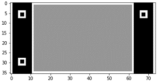
#### Figure 2. QR code example.


### Extract.py
Run the code from the terminal using the following format on the linux server and ensure to type the file names for the  '< >' desired arguments below:

    python3 extract.py <image_name.jpg> <output.txt> 
The first task of extract.py was to open the image using the PIL library and create a dictionary to decrypt the binary answers. The image was cropped to a small region using the relative location of where the QR code was injected. 

The first approach to detect the QR code did not go as expected. A convolution was performed on the cropped region using a kernel similar to the three boundary boxes. The idea was to find the center coordinates of the three boundary boxes using of the brightest value after convolution. Figure #3 is the result of this experiment.

The next approach at QR code detection was a pixel scanning method. A check list was generated based on a segment of pixel values that ranged across the center of the QR boundary box, and used to compare against a list of similar length of scanned values. To deal with noise during scanning, each pixel is replaced by 255 or 0 if the original value was less than 150 or not. The values of pixels in each row of the image are saved to a list and compared against the boundary box check list. The x and y coordinates are saved in a point list each time the previous values in the scanned row list and check list values match. These points correspond to the pixel located at the middle-right of the boundary box.

The height and width of the binary matrix was found based on the points in the point list. The values were extracted to a list, and the 255 values were altered to 1. This list was converted to an array then the superpixel values were averaged to determine if the pixel was white or black using the detected matrix boundaries. Using this array, a list of string values were generated for each superpixel. Every five string elements are combined to generate a list used to decrypt the binary answer. During the decryption, the question/answer number is concatenated with the corresponding answer. The answer key list was combined with newline characters (‘\n’), written, and saved to the output file to conclude the program.
#### Figure 3. Convolution performed on a QR code example.
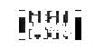

## grade.py

`grade.py` receives the form scan of the form as an image and extracts the shaded responses as well as whether something was written next to a question. 

### Usage

```bash
python3 grade.py <form> <results>
```

Example:

```bash
python3 grade.py test-images/a-27.jpg a-27_results.txt
```

The program is expected to take about 40s to run on a single image.

#### testing
`./test_grade.sh` runs the `grade.py` against all test-images and store the results in `results` directory. It also compares the output against the corresponding groundtruth file present in `test-images/`. 

It is observed that the `grade.py` has **100%** accuracy on all the test images. 

### Approaches

We tried different ways to extract the poistion of the boxes.

#### Grid Overlay

The intention was to manually estimate the pixel offsets both horizontally and vertically using a test image to fit a grid over the answers portion of the form. The grid can then be used to index individual boxes to obtain access to them. The problem with this method is that it is not translation, scaling, or rotation invariant.
The predicted grid did not fit all the test images, as shown in the image below. 


#### Pair of Horizontal and Vertical Lines

Any algorithm that extracts the positions of the boxes must be translation invariant, which means it must be able to determine where the answers block begins in both horizontal and vertical directions. As a result, the Hough transform was used on a thresholded image to determine the topmost vertical and leftmost horizontal lines, which subsequently indicate where the block begins. 

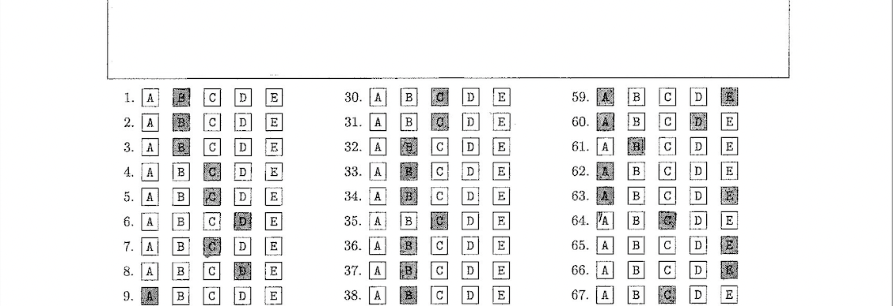

This method is not robust to other lines that may emerge as in the figure above, where a horizontal line appears above the answer form and might be interpreted as the starting point for the answers block. In addition, the Hough transform may not always find the same left and top grid lines perfectly due to the printing ink contrast. 

#### Vertical Patches

The idea is to find the vertical lines that join the boxes and extract vertical patches having only a stack of boxes, which can then be processed further. This approach will be translation and scale invariant after being corrected for rotational tilt. This method of extracting vertical patches and recognizing shaded boxes is detailed in the following section. 


### Methodology

- Preprocessing
    - Use 5x5 Gaussian blur to reduce noise
    - Invert and threshold the image such that pixels values less than 200 are set to 0 otherwise 255.
- Identify and correct the tilt
- Identify and select prominent vertical lines
- Extract vertical patches
- Identify shaded boxes
- Identify whether something was written next to questions


### Hough Lines

Hough transform algorithm is implemented from scratch to find the straight lines in the image. This algorithm can work with varying $\rho$-$\theta$ grid resolutions.

The code for HoughLines is in [houghLines.py](houghLines.py)

Algorithm:
- \rho, $\theta$ are discretized using the resolutions provided within the range $-d \le \rho \le d$, $d = \sqrt{w^2 + h^2}$ and $0 \le \theta < \pi$ respectively.
- An accumulator is grid is constructed by using discretized $\rho$ and $\theta$.
- For each non zero pixel in the input image, all possible pairs of $\rho$ and $\theta$ are obtained fixing (x,y) using the equation $\rho = x cos(\theta) + y sin(\theta)$
    - For each pair the corresponding grid value in the accumulator is incremented.
- Finally, $\rho$ and $\theta$ for the grid cells that exceed the vote threshold given are returned.

This algorithm is an improved version of [5]: added variable $\rho$ and $\theta$ resolutions and used numpy function to eliminate loops.


|                                     Example Image                                     |                                              Hough Space                                              |
| :-----------------------------------------------------------------------------------: | :---------------------------------------------------------------------------------------------------: |
| 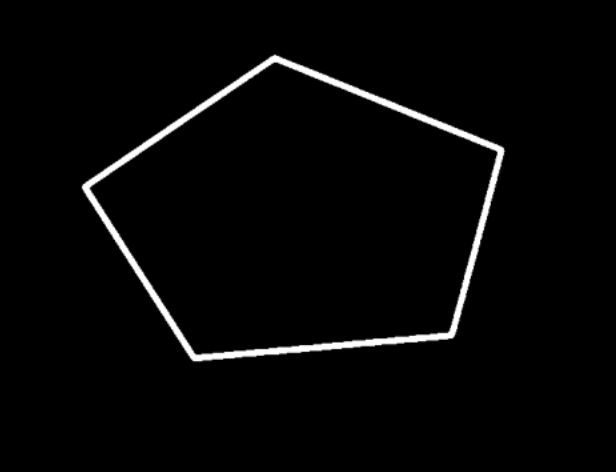 | 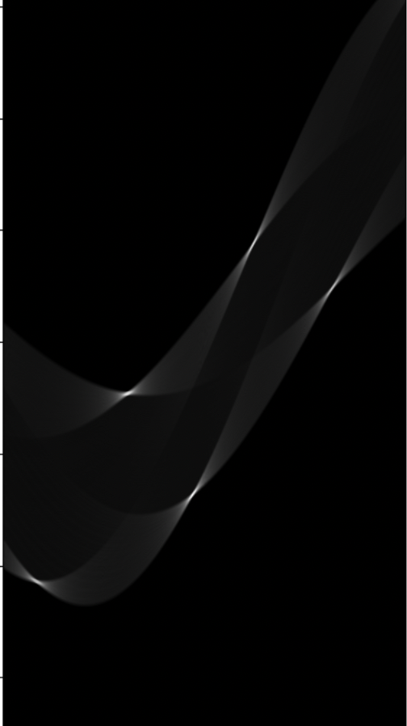 |

The above image is a inverse threshold version found in [2].

### Tilt Correction

We determine the angular deviation of the lines from the horizontal and rotate the image in the opposite direction to make the method resilient to tilts in the image.


The image is preprocessed with gaussian blur, inverse thresholding, and Sobel filter to find horizontal edges.
Lines closer to slope 90 (horizontal) are then found using the Hough transform by using a fine grid where theta resolution is set to 1/16th of degree.
The tilt $theta$ away from the horizontal is indicated by the average slope of the selected lines.
After that, the entire image is rotated by $-theta$ around the center. This makes lines joining boxes vertical and accessing the boxes by horizontal and vertical offset feasible. 

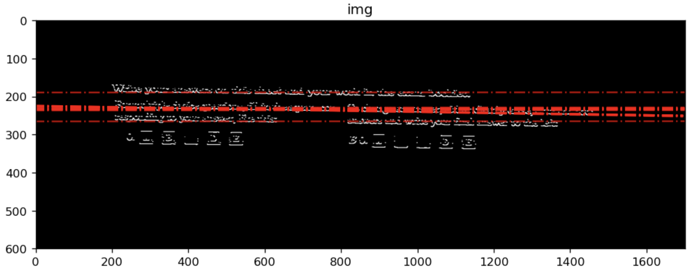


|                                   Original with tilt                                    |                                   After tilt correction                                    |
| :-------------------------------------------------------------------------------------: | :----------------------------------------------------------------------------------------: |
| 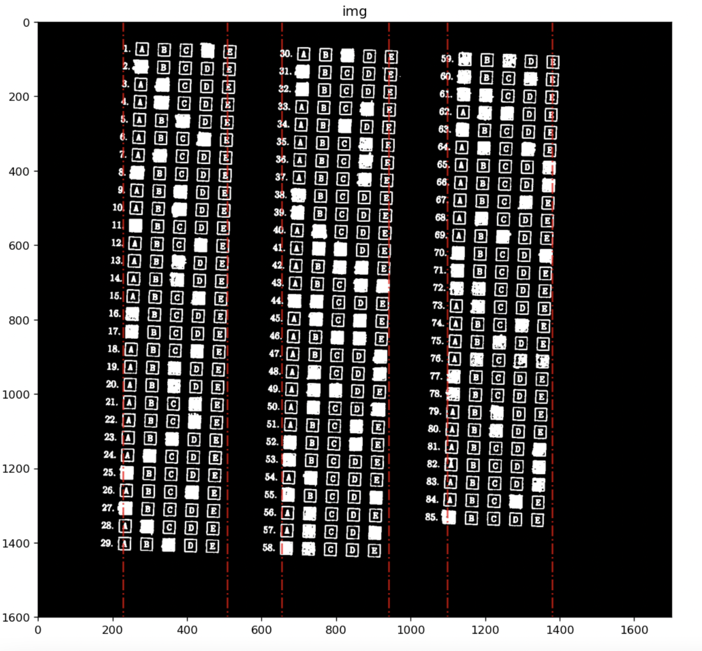 | 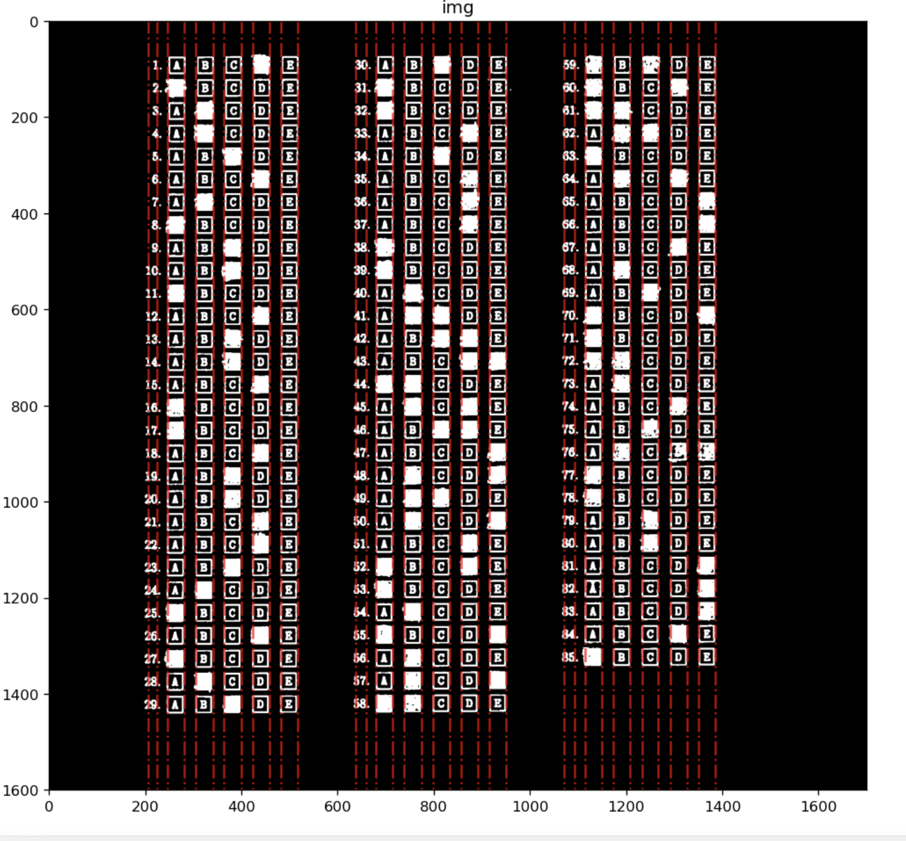 |


## Identifying the vertical lines

Before applying the Hough Transform, the image is blurred with a 5x5 gaussian filter and inverse thresholded.
The grid is finer, with a $\rho$ result of 1/4th of a pixel and a $\theta$ resolution of 1/4th of a degree.
To extract as many lines as feasible, the vote threshold is set low (300).
The lines are then filtered to maintain only those with slopes near zero or 180 degrees.


The vertical lines discovered after using the above procedure are depicted in the image below. 


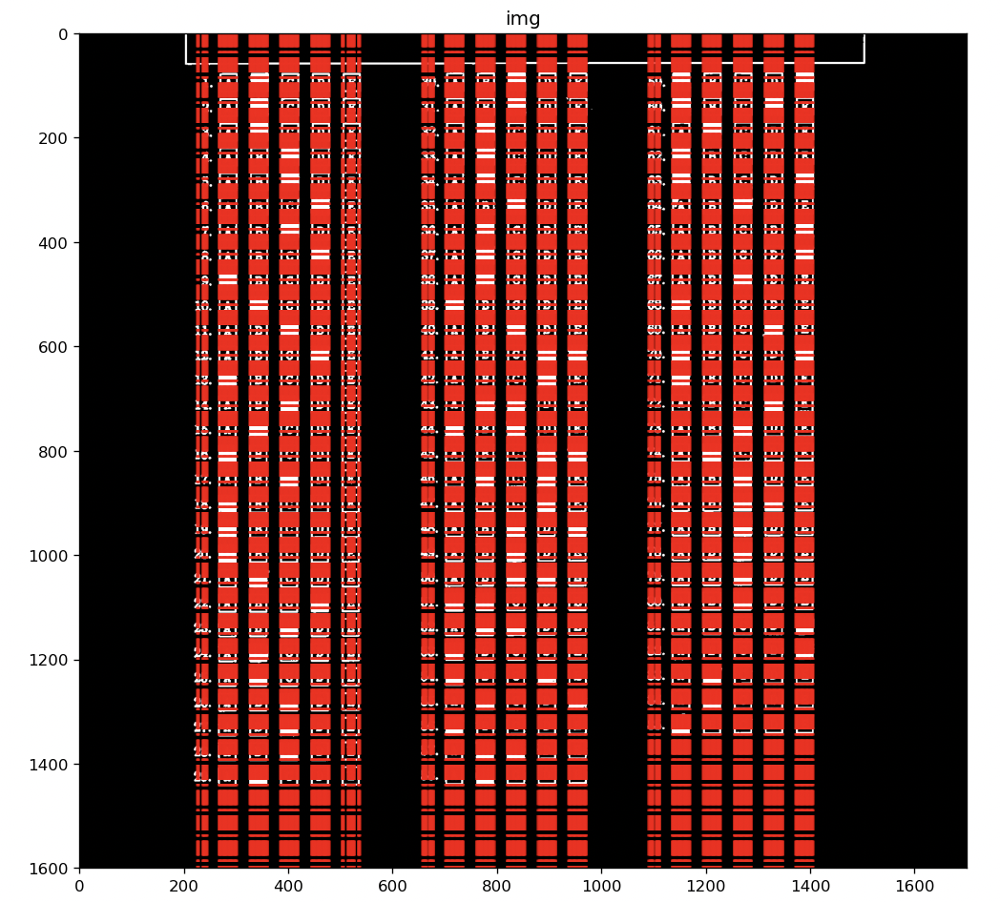


Because of pixels in letters (options: A B C D E) and pixels from darkened boxes, there are too many lines that pass through the boxes.
By combining lines that are close together, these extra lines are removed.


The merging procedure is as follows: all vertical lines are sorted using $\rho$ so that the lines that are next to each other in the image are also side by side in the array.
The lines are then looped over until only those that are $k$ pixels apart in $\rho$ values are kept.
Only the vertical lines that cross through the vertical margins of the boxes are left after this technique as it eliminates lines that are close to each other. 


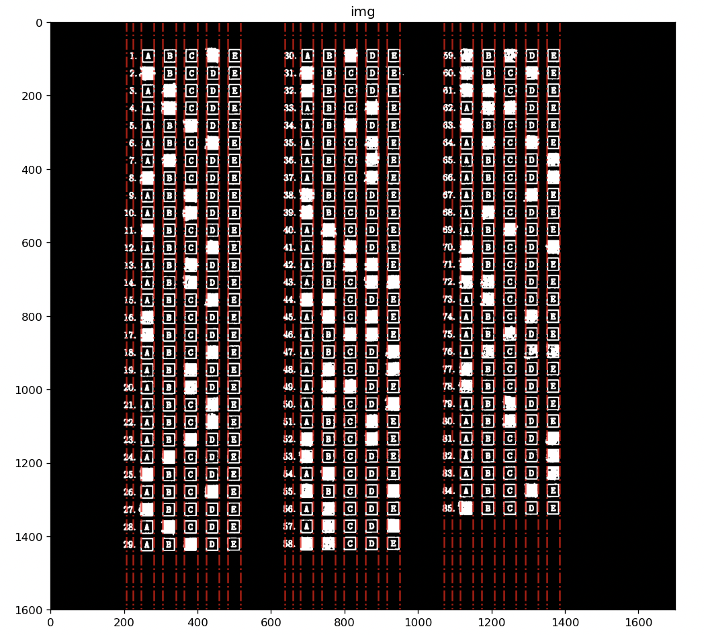


### Extracting the vertical patches

After the above step, 36 prominent vertical lines are extracted. Each of these lines divide the image to smaller regions of vertical patches.

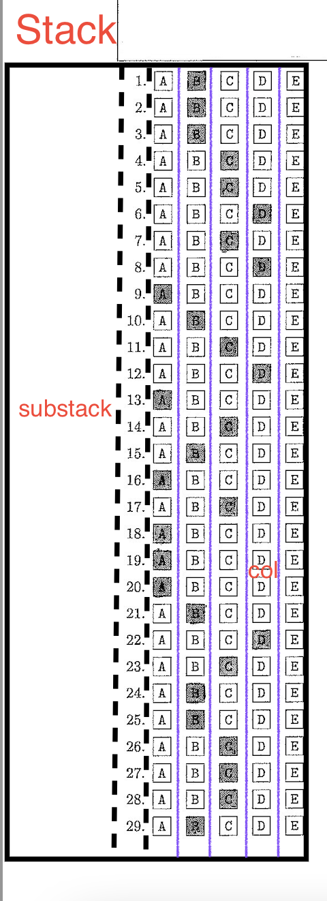

The questions are arranged into 3 "stacks". Each _stack_ contains 3 "substacks" (showed in the image using dotted lines), the first _substack_ contains the written characters, the question numbers are in the second and the third thas the boxes.

The third _substack_ is further divided into 5 columns "col"s that has options A, B, C, D, E in that order. Using these three paramters _stack_, _substack_, and _col_, a particular vertical patch can be extracted.

These paramters are zero indexed, _stack_, _substack_ has 0,1,2 values, and _col_ has 0,1,2,3,4 values.

For example, the options B vertical patch of questions 30-58 is extracted using 

```
stack = 1
substack = 2
col=1
```

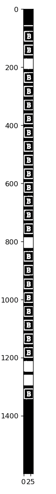


### Identifying the shaded boxes

To identify the shaded boxes as well as to extract the start and end positions of boxes in the vertical patch.

For a vertical patch extracted in the previous section, if the pixel values in the x - direction were averaged, a signal of length equal to height of the image is formed. This signal is plotted in the below image, y-axis represents signal strength and x-axis corresponds to vertical offset in the image.


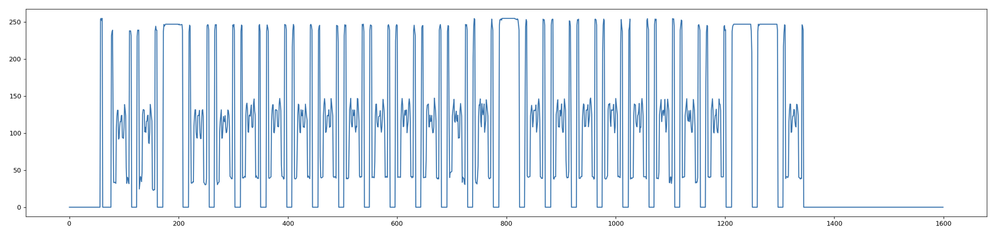

We can discern the following from this graph

- The shaded box will have intensities higher than unshaded boxes.
- The gaps between the boxes can be seen where the signal strength is close to zero.
- Height of a box corresponds to width of the signal that is non-zero
- Spurious lines coming from unexpected lines in the image or noisy Hough transform can be eliminated by considering the portions in the graph where the signal is non zero and has a certain width.

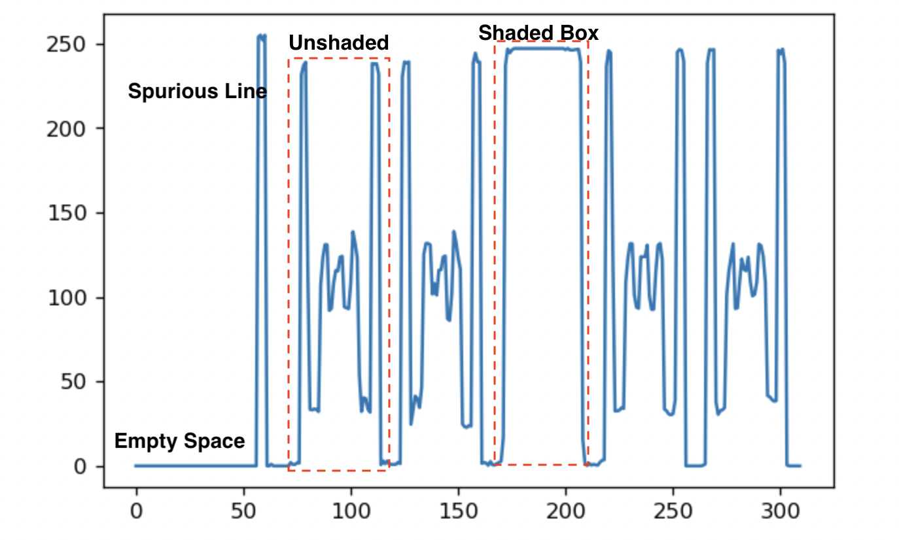


An approach to segment the boxes and identify whether shaded or not:
1. Using two-pass connected component labelling algorithm [6] we segment the signal. 
2. Eliminate components whose width is smaller than $w$ pixels.
3. Average the signal in each segment, if the average is greater than threshold $s$, then mark that segment as shaded.


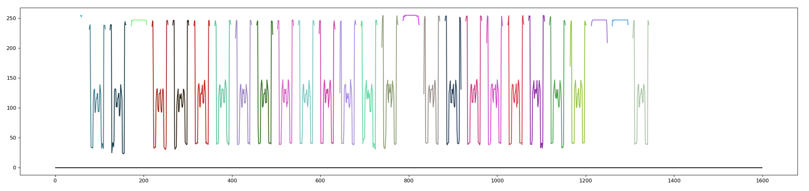

We identify the shaded boxes for each vertical patch in each stack, which tells us which choice is shaded for each question.
All shaded responses for all questions can be identified by maintaining an option accumulator for each question and looping through all vertical patches. 


### Identifying the written characters

The edges of the segmented components represents the horizontal sides of the boxes, (`y_start`, `y_end`). Using this information and _substack_=1 vertical patch, the space where written characters exists can be extracted for each question.

If the average intensity of this small patch is greater than a certain threshold, then it is assumed that there was something written in this patch. 

Reducing this threshold will increase false-positives because of noise or the presence of box edges leaking over from the adjacent vertical patches.


## Results
Veritical patches method has 100% accuracy on all test-images.
 
 
## Discussion
### Inject.py and Extract.py
Convolutions did not make it in the file code for extract.py but were used to conduct experiments for the QR code detection. When testing convolutions on the image for custom kernels utilizing code from Lab1, the code execution would run for well over an hour on the full image file. To combat this, the image was reduced and used a cropped region of the original image to reduce the code execution duration.

The inject.py and extract.py code works very well on images where they have not been printed and scanned between inject.py and extract.py. If a black pixel were to be added into the QR code where a white pixel should be, then it could cause an error when decrypting the answers. When using the injected image exported in JPG file format, I found that the pixel values were no longer 0 and 255. I added code to change them back to 0 and 255; however, exporting the image using PNG file format will not cause these artifacts. 

When scaling down the 2x2 matrix, the code originally took the first pixel in each super-pixel to determine the answer. This could be an issue if the image noise changes the pixel values and could result in an incorrect answer key. To make the detection more robust, the averages of the super-pixel values were used to scale down the answer matrix would be the future of this program. 

If the image is flipped or rotated slightly, the QR code becomes undetectable without utilizing more computer vision techniques. Also, the answer key detection would potentially fail if the QR code was marked on with a pen or ink smudges. Scaling the QR code more could make it more robust to noise but may cause the program to run longer.

## Conclusions


## Acknowledges
### Bryant Cornwell 
Wrote a majority of the code for inject.py and extract.py, and contributed to the research and ideas for developing the QR code. Also provided partial starter code and ideas for tackling the Hough Transform utilizing methods and ideas from Wikipedia [4]. For the report, Wrote the inject.py and extract.py sub-sections within the Methods section.
When the assignment was initially released, the assignment was discussed at a high level with another classmate, Seth Mize.
### Deepak Duggirala
Provided initial QR code detection approach. Wrote the grade.py. Details are shown in grade-report.md. Wrote the whole grade-report.md.
### Li Sun
Contributed to the research and ideas for developing the QR code. Tried erosion method for extraction of the marked areas. Helped to test codes on burrow.luddy.indiana.edu. Wrote the abstract, introduction, .... parts of this report.

## References
[1] https://en.wikipedia.org/wiki/QR_code

[2] https://pillow.readthedocs.io/en/stable/reference/Image.html?highlight=fromarray#PIL.Image.fromarray

[3] https://pillow.readthedocs.io/en/stable/reference/Image.html?highlight=paste#PIL.Image.Image.paste

[4] https://en.wikipedia.org/wiki/Hough_transform#Kernel-based_Hough_transform_(KHT)

[5] https://alyssaq.github.io/2014/understanding-hough-transform/ [Understanding Hough Transform With Python]

[6] https://moonbooks.org/Articles/Implementing-a-simple-python-code-to-detect-straight-lines-using-Hough-transform/

[7] https://en.wikipedia.org/wiki/Connected-component_labeling
