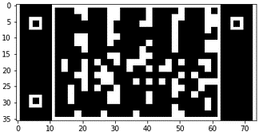

# Assignment #1 Report
Group Members: Deepak Duggirala, Bryant Cornwell, Li Sun

## Abstract

## Introdcution

## Methods
### Inject.py
Run the code from the terminal using the following format on the linux server:

Python3 inject.py <image_name.jpg> <key_name.txt>

The first task of inject.py was to open the image using the PIL library and create a list of each line of the answer key file. The numbers and special characters were then removed to generate a list of answer. The first idea of encrypting the answer key was to use character encoding. However, failed to find an accurate/robust way to read decrypt the answer key without using other computer vision libraries.

From there the team discussed ways of implementing a QR-code and bar code using information and ideas from Wikipedia(reference). Since bar and QR codes use black and white pixels, we determined that we would need to encode the answers using binary operations. To encode all 31 answer options, it required five pixels per question (2^5 = 32). The group decided that the encoded answers would need be scaled up to avoid noise. 

There are 85x5=425 total pixels, so a 17x25 matrix to fit into the QR code was used to create a better representation. An answer dictionary was created and utilized to convert the answers to a 5-digit binary string. This binary list was concatenated to a single string then to a 17x25 matrix of int values. From here, the matrix was scaled up to a 34x50 matrix by converting a single pixel to a 2x2 super-pixel. 

The QR code was developed based on the 34x50 matrix as seen in Figure #1; where the gray portion of the image is where the encoded answer matrix would be placed. The scaled matrix is then placed within the QR code boundary, and all values were multiplied by 255 to generate white pixels. Figure #2 shows an example of a QR code for the a-27 test answer key. The “Image.fromarray()” function was used to convert the NumPy array into an image object. The “Image.paste()” function was utilized to place and position the image object on the desired image. The injected image was saved to a file to conclude the program.

#### Figure 1. QR code boundary.

#### Figure 2. QR code example.

### Extract.py
 
#### Figure 3. Convolution performed on a QR code example.

## Results
 

 
 
## Discussion

## Conclusions

## Acknowledges

## References

