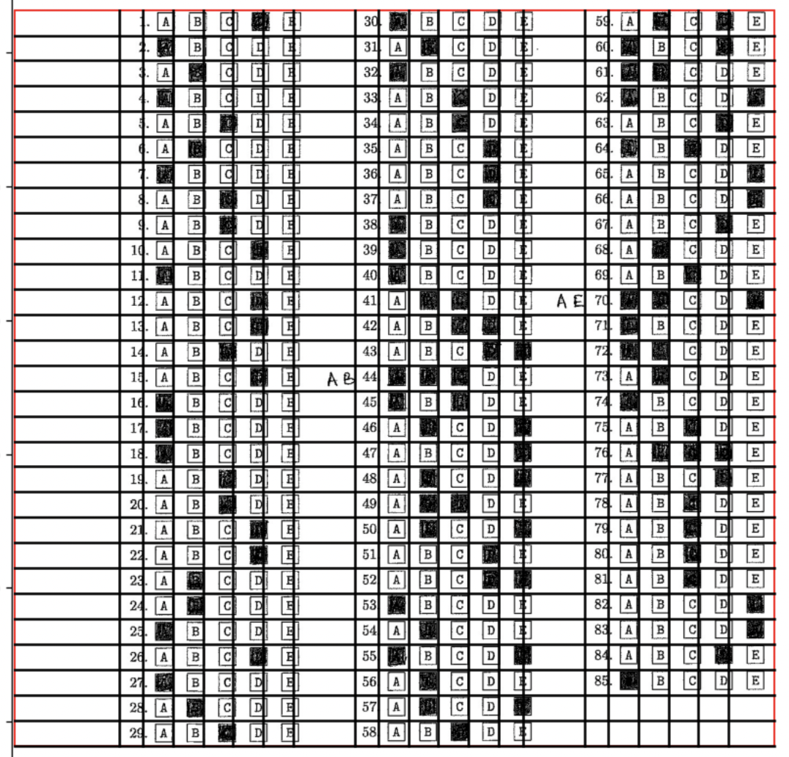
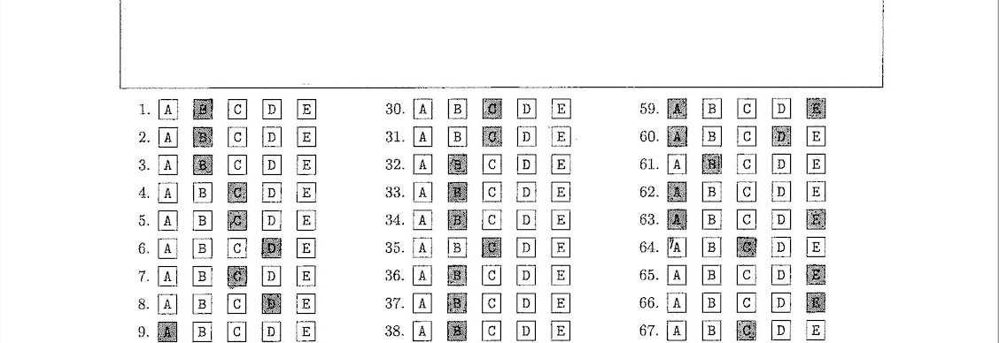
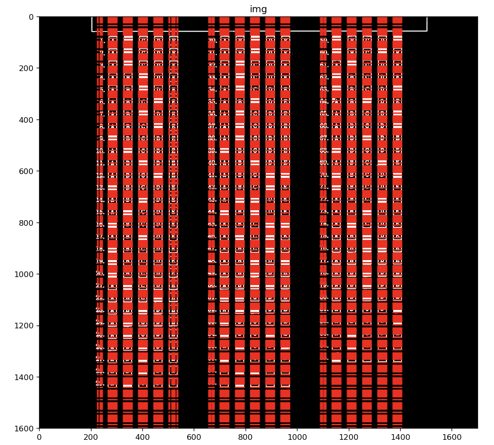
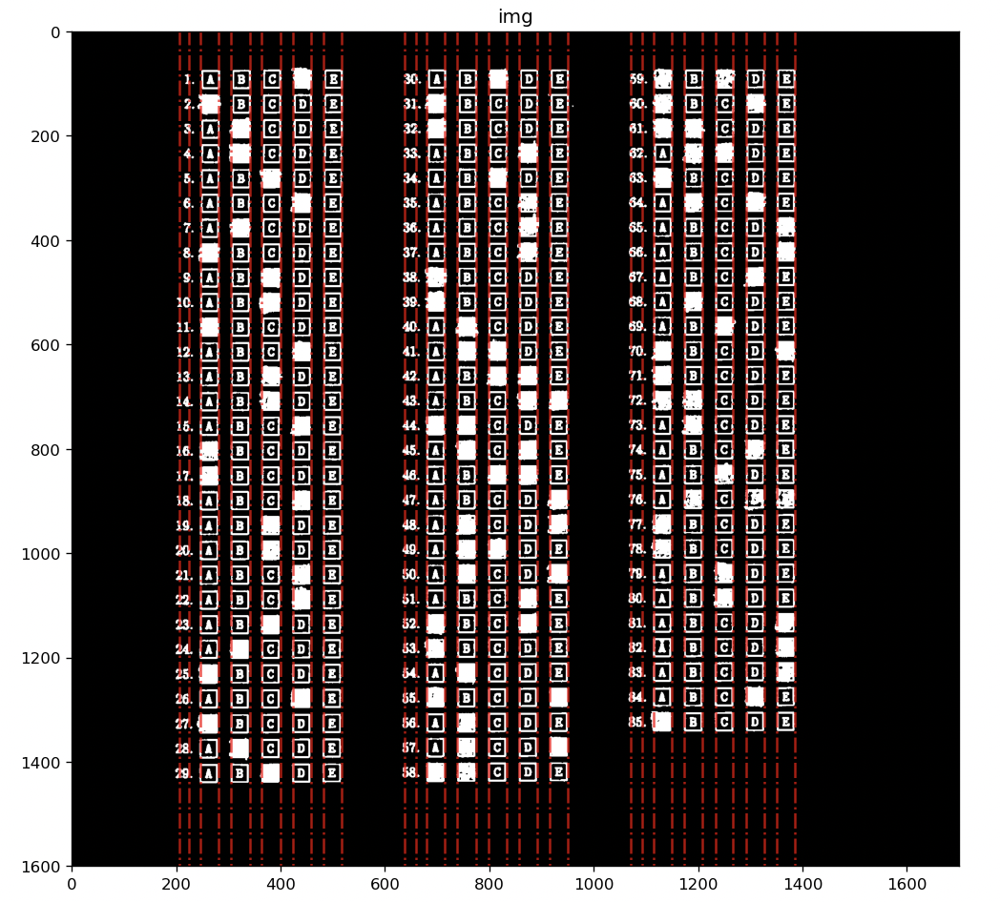
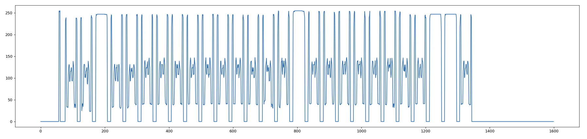
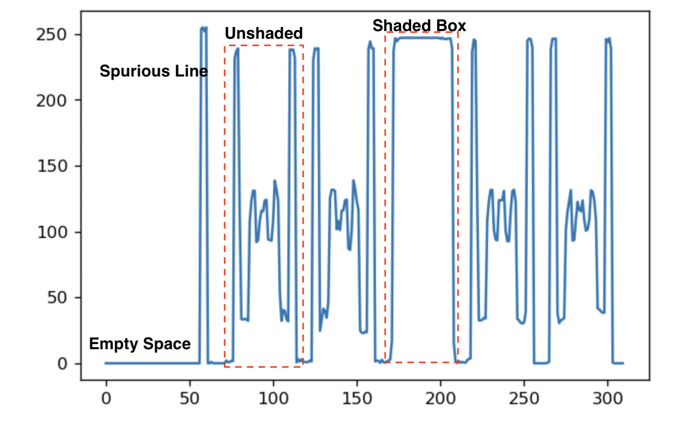

# grade.py

`grade.py` receives the form scan of the form as an image and extracts the shaded responses as well as whether something was written next to a question. 

### Usage

```bash
python3 grade.py <form> <results>
```

Example:

```bash
python3 grade.py test-images/a-27.jpg a-27_results.txt
```

## Approaches

We tried different ways to extract the poistion of the boxes.

### Grid Overlay

The intention was to manually estimate the pixel offsets both horizontally and vertically using a test image to fit a grid over the answers portion of the form. The grid can then be used to index individual boxes to obtain access to them. The problem with this method is that it is not translation, scaling, or rotation invariant.
The predicted grid did not fit all of the test images, as shown in the image below. 




### Pair of Horizontal and Vertical Lines

Any algorithm that extracts the positions of the boxes must be translation invariant, which means it must be able to determine where the answers block begins in both horizontal and vertical directions. As a result, the Hough transform was used on a thresholded image to determine the topmost vertical and leftmost horizontal lines, which subsequently indicate where the block begins. 



This method is not robust to other lines that may emerge as in the figure above, where a horizontal line appears above the answer form and might be interpreted as the starting point for the answers block. In addition, the Hough transfrom may not always find the same left and top grid lines perfectly due to the printing ink contrast. 

### Vertical Patches

The idea is to find the vertical lines that join the boxes and extract vertical patches having only a stack of boxes, which can then be processed further. This approach will be translation and scale invariant after being corrected for rotational tilt. This method of extracting vertical patches and recognizing shaded boxes is detailed in the following section. 


## Methodology

- Preprocessing
    - Use 5x5 Gaussina blur to reduce noise
    - Invert and threshold the imgae such that pixels values less than 200 are set to 0 otherwise 255.
- Identify and correct the tilt
- Idetify and select prominent vertical lines
- Extract vertical patches
- Identify shaded boxes
- Identify whether something was written next to questions


## Hough Lines

Hough transform algorithm is implemented from scratch to find the straight lines in the image. This algorithm can work with varying $\rho$-$\theta$ grid resolutions.


Algorithm:
- $\rho$, $\theta$ are discretized using the resolutions provided within the range $-d \le \rho \le d$, $d = \sqrt{w^2 + h^2}$ and $0 \le \theta < \pi$ respectively.
- An accumulator is grid is constructed by using dicretized $\rho$ and $\theta$.
- For each non zero pixel in the input image, all possible pairs of $\rho$ and $\theta$ are obtained fixing (x,y) using the equation $\rho = x cos(\theta) + y sin(\theta)$
    - For each pair the corresponding grid value in the accumulator is incremented.
- Finally, $\rho$ and $\theta$ for the grid cells that exceed the vote threshold given are returned.

This algorithm is an improved version of [1].


Example Image             |  Hough Space
:-------------------------:|:-------------------------:
  |  

The image is a inverse threshold version found in [2].

## Tilt Correction

We determine the angular deviation of the lines from the horizontal and rotate the image in the opposite direction to make the method resilient to tilts in the image.


The image is preprocessed with gaussian blur, inverse thresholding, and sobel filter to find horizontal edges.
Lines closer to slope 90 (horizontal) are then found using the Hough transform by using a fine grid where theta resolution is set to 1/16th of degree.
The tilt $theta$ away from the horizontal is indicated by the average slope of the selected lines.
After that, the entire image is rotated by $-theta$ around the center. This makes lines joining boxes vertical and accessing the boxes by horizontal and vertical offset feasible. 


Original with tilt             |  After tilt correction
:-------------------------:|:-------------------------:
  |  


## Identifying the vertical lines

Before applying the Hough Transform, the image is blurred with a 5x5 gaussian filter and inverse thresholded.
The grid is finer, with a $\rho$ result of 1/4th of a pixel and a $\theta$ resolution of 1/4th of a degree.
To extract as many lines as feasible, the vote threshold is set low (300).
The lines are then filtered to maintain only those with slopes near zero or 180 degrees.


The vertical lines discovered after using the above procedure are depicted in the image below. 





Because of pixels in letters (options: A B C D E) and pixels from darkened boxes, there are too many lines that pass through the boxes.
By combining lines that are close together, these extra lines are removed.


The merging procedure is as follows: all vertical lines are sorted using $\rho$ so that the lines that are next to each other in the image are also side by side in the array.
The lines are then looped over until only those that are $k$ pixels apart in $\rho$ values are kept.
Only the vertical lines that cross through the vertical margins of the boxes are left after this technique as it eliminates lines that are close to each other. 





## Extracting the vectical patches

After the above step, 36 prominent vertical lines are extracted. Each of these lines divide the image to smaller regions of vertical patches.


The questions are arranged into 3 "stacks". Each _stack_ contains 3 "substacks" (showed in the image using dotted lines), the first _substack_ contains the written characters, the question numbers are in the second and the third thas the boxes.

The third _substack_ is further divided into 5 columns "col"s that has options A, B, C, D, E in that order. Using these three paramters _stack_, _substack_, and _col_, a particular vertical patch can be extracted.

These paramters are zero indexed, _stack_, _substack_ has 0,1,2 values, and _col_ has 0,1,2,3,4 values.

For example, the options B vertical patch of questions 30-58 is extraced using 

```
stack = 1
substack = 2
col=1
```


## Identifying the shaded boxes

To identify the shaded boxes as well as to extract the start and end positions of boxes in the vertical patch.

For a vertical patch extracted in the previous section, if the pixel values in the x - direction were averaged, a signal of length equal to height of the image is formed. This signal is plotted in the below image, y-axis represents signal strength and x-axis corresponds to vertical offset in the image.




We can discren the following from this graph

- The shaded box will have intensities higher than unshaded boxes.
- The gaps between the boxes can be seen where the signal strength is close to zero.
- Height of a box corresponds to width of the signal that is non-zero
- Spurious lines coming from unexpected lines in the image or noisy Hough transform can be elimiated by considering the portions in the graph where the signal is non zero and has a certain width.




An approach to segment the boxes and identify whether shaded or not:
1. Using two-pass connected component labelling algorithm [3] we segment the signal. 
2. Eliminate components whose width is smaller than $w$ pixels.
3. Average the signal in each segment, if the average is greater than threshold $s$, then mark that segment as shaded.


We identify the shaded boxes for each vertical patch in each stack, which tells us which choice is shaded for each question.
All shaded responses for all questions can be identified by maintaining an option accumulator for each question and looping through all vertical patches. 


## Identifying the written characters

The edges of the segmented components represents the horizontal sides of the boxes, (`y_start`, `y_end`). Using this information and _substack_=1 vertical patch, the space where written characters exists can be extracted for each question.

If the average intensity of this small patch is greater than a certain threshold, then it is assumed that there was something written in this patch. 

Reducing this threshold will increase false-poitives because of noise or the presence of box edges leaking over from the adjacent vertical patches.


## References


[1] https://alyssaq.github.io/2014/understanding-hough-transform/ [Understanding Hough Transform With Python]

[2] https://moonbooks.org/Articles/Implementing-a-simple-python-code-to-detect-straight-lines-using-Hough-transform/

[3] https://en.wikipedia.org/wiki/Connected-component_labeling